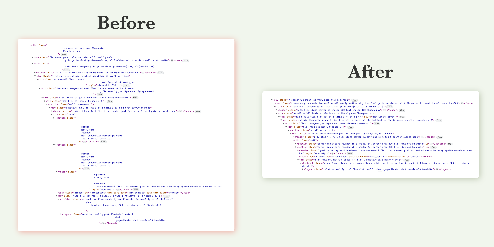

> WARNING: In development, not tested in production. You should probably wait for the first major version.

# JSX trim

[![npm package][npm-img]][npm-url]
[![Downloads][downloads-img]][downloads-url]
[![Issues][issues-img]][issues-url]




Using multiline template strings to set jsx classnames?

You might have seen all the extra whitespace in your html output, which makes using the browser devtools a pain. Use this transformer to get rid of consecutive, leading and trailing whitespaces in classname attributes.


## Support us

[](https://spatie.be/github-ad-click/spatie.be)

We invest a lot of resources into creating [best in class open source packages](https://spatie.be/open-source). You can support us by [buying one of our paid products](https://spatie.be/open-source/support-us).

We highly appreciate you sending us a postcard from your hometown, mentioning which of our package(s) you are using. You'll find our address on [our contact page](https://spatie.be/about-us). We publish all received postcards on [our virtual postcard wall](https://spatie.be/open-source/postcards).

## Installation

```bash
npm install jsx-trim
```

```bash
yarn add jsx-trim
```

## Usage

### Babel
Add the plugin to your babel config
```ts
[
  "@babel/plugin-transform-react-jsx",
  { runtime: 'automatic', importSource: 'jsx-trim' }
]
```

### vite:
With `@vitejs/plugin-react` installation is just one line.
```js
export default defineConfig(() => ({
  plugins: [
    react({
      jsxImportSource: 'jsx-trim'
    })
  ]
}));
```

## Changelog

Please see [releases](https://github.com/spatie/jsx-trim/releases) for more information what has changed recently.

## Contributing

Please see [CONTRIBUTING](https://github.com/spatie/.github/blob/main/CONTRIBUTING.md) for details.

## Security

If you've found a bug regarding security please mail [security@spatie.be](mailto:security@spatie.be) instead of using the issue tracker.

## Credits

- [Sam Apostel](https://github.com/Sam-Apostel)
- [All Contributors](../../contributors)

## License

The MIT License (MIT). Please see [License File](LICENSE) for more information.

[build-img]:https://github.com/spatie/jsx-trim/actions/workflows/release.yml/badge.svg
[build-url]:https://github.com/spatie/jsx-trim/actions/workflows/release.yml
[downloads-img]:https://img.shields.io/npm/dt/jsx-trim
[downloads-url]:https://www.npmtrends.com/jsx-trim
[npm-img]:https://img.shields.io/npm/v/jsx-trim
[npm-url]:https://www.npmjs.com/package/jsx-trim
[issues-img]:https://img.shields.io/github/issues/spatie/jsx-trim
[issues-url]:https://github.com/spatie/jsx-trim/issues